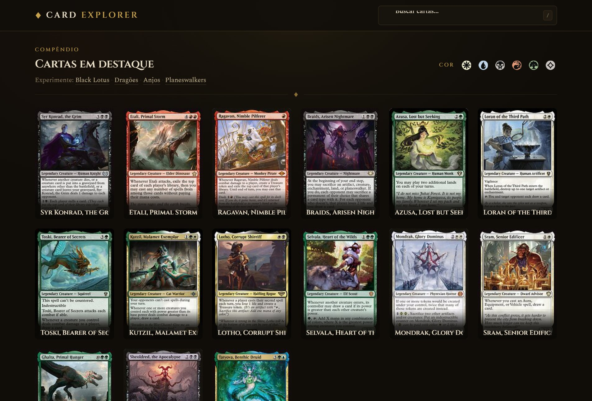
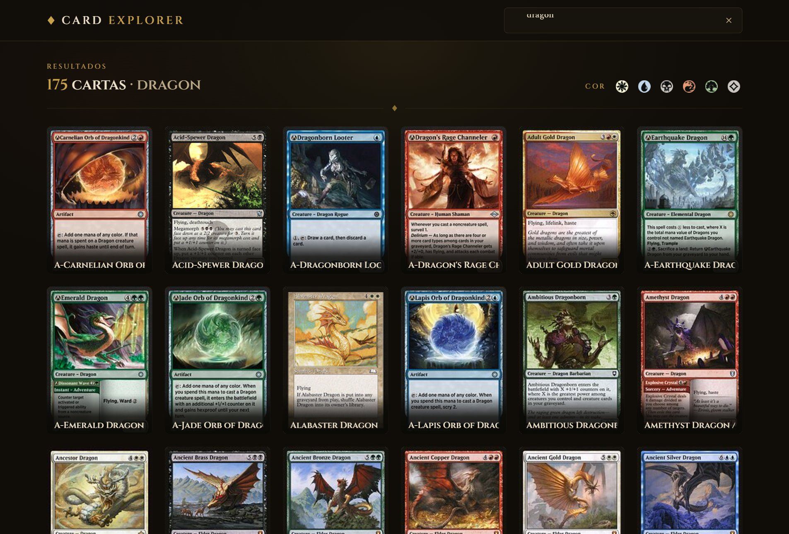
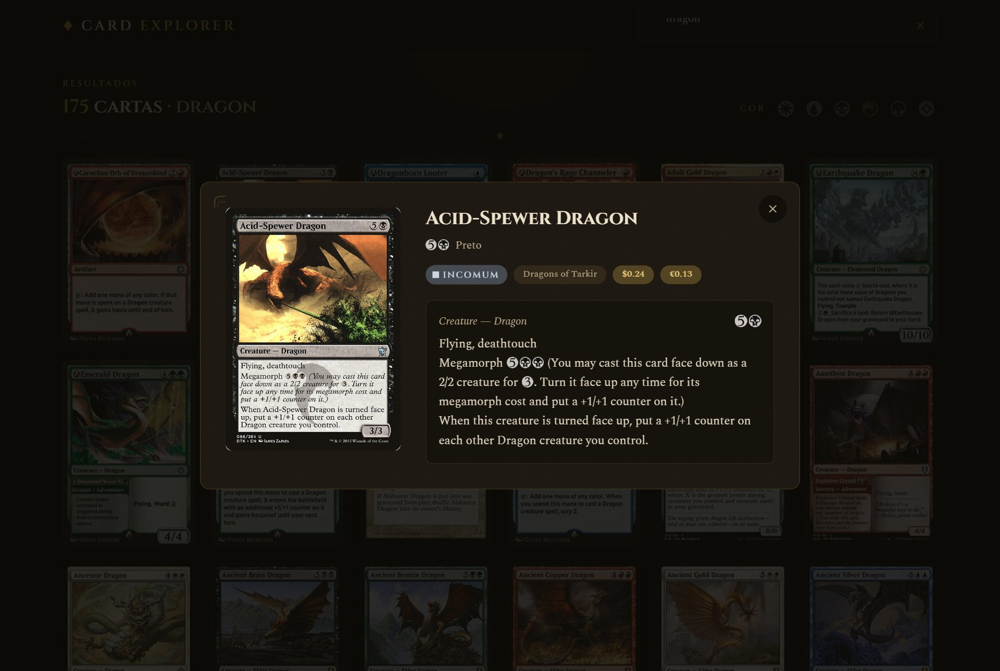
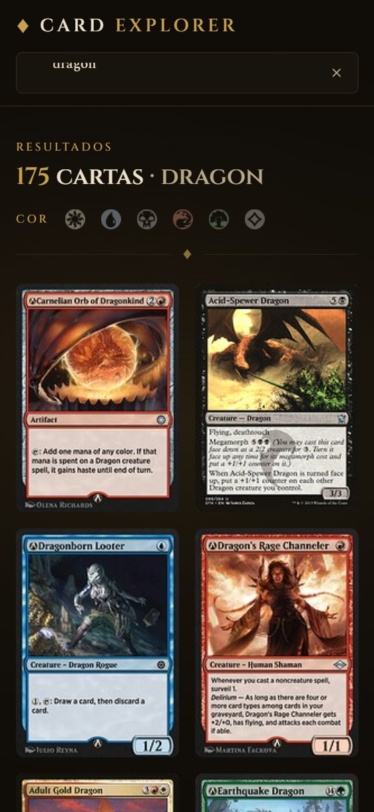

# Card Explorer

Aplicação web para busca e exploração de cartas de *Magic: The Gathering*, consumindo a [API pública do Scryfall](https://scryfall.com/docs/api). O usuário pesquisa cartas pelo nome, navega pelos resultados em uma grade responsiva e abre qualquer carta para ver suas informações completas.

> Desafio técnico Simbiox.

## Demonstração

🔗 **Demo ao vivo:** **https://magic-simbiox.vercel.app/**



<table>
  <tr>
    <td width="50%"></td>
    <td width="50%"></td>
  </tr>
  <tr>
    <td align="center"><em>Busca com contagem de resultados e filtro por cor</em></td>
    <td align="center"><em>Detalhe da carta em modal, com símbolos de mana</em></td>
  </tr>
</table>

<p align="center">
  
  <br>
  <em>Grade responsiva em telas estreitas</em>
</p>

## Funcionalidades

- **Busca de cartas** pelo nome, com resposta conforme o usuário digita.
- **Vitrine de destaques** na tela inicial, para receber quem chega sem um termo em mente.
- **Filtro pelas cinco cores de mana** (branco, azul, preto, vermelho, verde e incolor), aplicável tanto aos destaques quanto aos resultados.
- **Sugestões de busca** e **atalho de teclado `/`** para focar o campo — reduzem o atrito de começar.
- **Contagem de resultados** exibida acima da grade.
- **Grade responsiva** que ajusta o número de colunas à largura da tela.
- **Detalhe da carta** em modal, com imagem, custo de mana, tipo, texto de regras, raridade, coleção e preço.
- **Símbolos de mana** renderizados como pips coloridos (no espírito das cartas de Magic), na grade e no detalhe.
- **Tratamento completo dos estados de uso**: inicial, carregando, sem resultados e erro.

## Design e experiência

A interface tem o conceito de um **compêndio arcano**: tema escuro e quente (tinta e ouro velho), tipografia serifada — *display* (Cinzel) nos títulos e *Spectral* no corpo — e ornamentos discretos (fleurões, cantoneiras, textura de pergaminho no modal). O objetivo foi fugir do visual "template padrão" e construir uma identidade própria, temática, mas sóbria.

- **Layout editorial**: cabeçalho à esquerda (marca + busca), sem *hero* genérica; a busca fica fixa no topo e acessível a qualquer momento.
- **As cinco cores como sistema**: a identidade de cor de Magic vira um recurso real de navegação (filtro) e aparece de forma consistente nos pips de mana e no detalhe.
- **Microinterações discretas**: elevação no *hover* das cartas, entrada em cascata da grade e transições suaves do modal — sempre respeitando `prefers-reduced-motion`.
- **Detalhes de domínio**: raridade como "selo" (do bronze fosco ao dourado mítico) e custo de mana em pips, aproximando a UI da linguagem visual das cartas.

## Tecnologias

- **React 19** + **TypeScript**
- **Vite** (build e dev server)
- **Tailwind CSS 4** (estilização e design tokens, via plugin oficial do Vite)
- **ESLint** (padronização do código)

Nenhuma biblioteca adicional de UI ou de data-fetching foi utilizada. A decisão foi manter o projeto enxuto e demonstrar o tratamento de dados e estados diretamente, dada a escala do desafio.

## Como executar

Pré-requisitos: **Node.js 18+**.

```bash
# 1. Clone o repositório
git clone <url-do-repositorio>
cd magic-simbiox

# 2. Instale as dependências
npm install

# 3. Rode em modo de desenvolvimento
npm run dev
```

O terminal exibirá o endereço local (por padrão `http://localhost:5173`).

Para gerar a build de produção:

```bash
npm run build
npm run preview
```

Nenhuma variável de ambiente é necessária: a API do Scryfall é pública e não exige chave.

### Scripts disponíveis

| Script | O que faz |
| --- | --- |
| `npm run dev` | Sobe o servidor de desenvolvimento com HMR. |
| `npm run build` | Checagem de tipos (`tsc -b`) e build de produção em `dist/`. |
| `npm run preview` | Serve localmente a build de produção. |
| `npm run lint` | Roda o ESLint no projeto. |

## Estrutura do projeto

```
src/
├── api/
│   └── scryfall.ts        # Cliente HTTP e funções da API do Scryfall
├── components/
│   ├── SearchBar.tsx      # Campo de busca (ícone, limpar, atalho "/")
│   ├── CardGrid.tsx       # Grade responsiva de cartas
│   ├── CardItem.tsx       # Carta individual (clicável)
│   ├── CardDetails.tsx    # Modal de detalhe da carta
│   ├── ColorFilter.tsx    # Filtro pelas cinco cores de mana
│   ├── Pagination.tsx     # Navegação entre páginas de resultados
│   ├── ManaCost.tsx       # Custo de mana com ícones oficiais da Scryfall
│   ├── OracleText.tsx     # Texto de regras com símbolos inline
│   ├── RarityBadge.tsx    # Selo de raridade
│   ├── Ornament.tsx       # Ornamentos (fleurão, losango, cantoneira)
│   └── states/
│       ├── LoadingState.tsx  # Skeletons durante o carregamento
│       ├── EmptyState.tsx    # Estado inicial e "nenhum resultado"
│       └── ErrorState.tsx    # Erro com opção de tentar novamente
├── hooks/
│   ├── useCardSearch.ts     # Lógica de busca, estados e retry
│   ├── useFeaturedCards.ts  # Cartas em destaque da tela inicial
│   └── useDebounce.ts       # Debounce genérico do termo de busca
├── index.css              # Tokens de tema, tipografia e animações
├── types.ts               # Tipagem das cartas
├── utils.ts               # Utilitários (imagem, parse de mana, cores)
└── App.tsx                # Composição da interface
```

A organização é por tipo (`components`, `hooks`, `api`), o que se adequa a uma aplicação de uma única funcionalidade. A separação da lógica de dados (hooks e api) da camada de apresentação (componentes) mantém os componentes focados em renderizar. Os estados de carregamento, vazio e erro foram isolados em componentes próprios em `components/states/` para deixar explícito o cuidado com essas situações.

## Como a aplicação funciona

O fluxo é linear e cabe em poucas peças:

1. `App.tsx` guarda o termo digitado e a carta selecionada — são os dois únicos estados de interface.
2. `useCardSearch` recebe o termo, aplica o debounce e conversa com a camada de API, devolvendo `cards`, `status` e `retry`.
3. `status` é uma máquina de estados de quatro valores — `idle`, `loading`, `success` e `error` — e é ele quem decide o que a tela renderiza. Como `success` com lista vazia é diferente de `idle`, a mensagem "nenhum resultado para *X*" nunca aparece antes da primeira busca.
4. Clicar em uma carta apenas guarda o objeto já carregado em `selectedCard`, e o modal é renderizado a partir dele.

Nenhum estado derivado é duplicado: a lista, o status e a seleção têm cada um uma única fonte de verdade.

## Decisões técnicas

Alguns pontos que foram tratados com atenção por refletirem situações reais de uso:

- **Debounce na busca.** O termo digitado passa por um debounce de 400ms antes de disparar a requisição, evitando uma chamada a cada tecla pressionada. Isso melhora a experiência e respeita os limites de uso da API do Scryfall.

- **404 tratado como "nenhum resultado", não como erro.** A API do Scryfall retorna HTTP 404 quando a busca não encontra nenhuma carta. Esse caso é convertido em uma lista vazia na camada de API, de modo que a interface exiba um estado vazio amigável em vez de uma tela de erro. Os demais códigos (500, rede indisponível) continuam propagando como erro real, através de um `ScryfallError` que carrega o status HTTP.

- **Proteção contra condição de corrida.** Buscas em sequência podem ter suas respostas retornadas fora de ordem. O hook de busca ignora respostas de requisições que já foram substituídas por uma busca mais recente, garantindo que a tela sempre reflita o termo atual.

- **Reaproveitamento dos dados no detalhe.** O endpoint de busca do Scryfall já retorna o objeto completo da carta. Por isso, ao abrir o detalhe, o dado já disponível é reutilizado em vez de fazer uma nova requisição — o modal abre instantaneamente e uma chamada de API é economizada.

- **Cartas de dupla face.** Algumas cartas possuem duas faces, com imagem e texto separados. Tanto a imagem na grade quanto o modal tratam esse caso, evitando informação faltante ou imagem quebrada.

- **Erro com retry, não com recarga.** O estado de erro oferece um botão que refaz a busca do termo atual, sem exigir que o usuário recarregue a página ou redigite o que já havia digitado.

- **Acessibilidade e experiência do modal.** O modal fecha com `Esc`, clique no fundo ou no botão de fechar; trava a rolagem do fundo enquanto aberto; move o foco ao abrir; e usa os atributos ARIA adequados (`role="dialog"`, `aria-modal`).

- **Carregamento com skeletons.** Durante a busca, são exibidos skeletons no mesmo formato das cartas, o que suaviza a espera e evita que o layout "salte" quando os resultados chegam.

- **Imagens no tamanho certo.** A grade usa a versão `small` da imagem (fornecida pela Scryfall), muito mais leve que a `normal` — o que acelera bastante o carregamento de listas grandes. A `normal`, de maior resolução, fica reservada para o modal de detalhe. Cada imagem entra com um *fade* no momento em que termina de carregar (`onLoad`), ligado ao dado real em vez de a um atraso artificial.

- **Símbolos de mana oficiais.** Em vez de recriar os pips, o custo de mana usa os ícones SVG que a própria Scryfall disponibiliza (`svgs.scryfall.io/card-symbols/…`). O custo é parseado (`{2}{W}{U}` → `2`, `W`, `U`) e cada símbolo vira o ícone correspondente — inclusive híbridos —, garantindo fidelidade visual sem manutenção de assets. O mesmo vale para o **texto de regras**: tokens como `{W}` ou `{T}` no meio da frase são substituídos pelos ícones inline, em vez de aparecerem entre chaves.

- **Exibição paginada.** Os resultados são exibidos em páginas de 24 cartas. Como a Scryfall já devolve até 175 cartas por requisição, o gargalo é de renderização (cada carta é uma imagem) — paginar mantém o DOM leve e a navegação fluida mesmo em buscas grandes. A troca de página rola suavemente para o topo dos resultados.

## Cabeçalhos da API

Todas as requisições incluem o header `Accept`, conforme recomendado pela documentação do Scryfall para evitar bloqueio ou throttling do tráfego.

## Melhorias futuras

Com mais tempo, os próximos passos seriam:

- **Paginação no servidor** (via `next_page` da Scryfall) para navegar além das 175 cartas da primeira resposta — hoje a paginação é só de exibição, sobre o que já veio.
- **Mais filtros** (tipo e raridade) e busca no servidor por cor, complementando o filtro de cor atual, que atua sobre a página de resultados já carregada.
- **Cache dos termos já buscados**, para que voltar a uma busca anterior não custe nova requisição.
- **Testes automatizados** para os hooks e o cliente da API.
